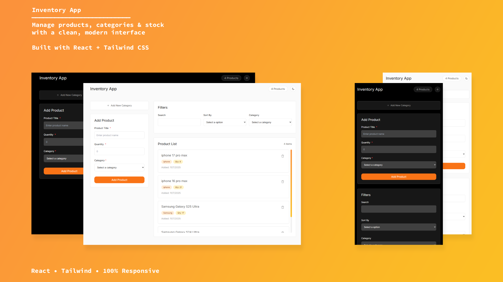

# Inventory Management App

A modern and efficient inventory management application built with React and Tailwind CSS. This app helps businesses track their products and categories with a clean, responsive interface and local storage persistence.

🔗 [Live Demo](https://siamak-khalili.github.io/inventory-react-app)

## Features

- 📦 Product Management (Add, Edit, Delete)
- 🏷️ Category Organization
- 🔍 Advanced Filtering System
- 🌓 Dark/Light Theme Toggle
- 💾 Local Storage Persistence
- 📱 Responsive Design
- 🎯 Form Validation
- ⚡ Fast and Efficient Performance

## Screenshots

| Screenshot                                 |
| ------------------------------------------ |
|  |

## Installation

Follow these steps to run the project locally:

```bash
# Clone the repository
git clone https://github.com/Siamak-Khalili/inventory-react-app.git

# Navigate to project directory
cd inventory-app

# Install dependencies
npm install

# Start development server
npm run dev
```

## Usage

1. **Add Categories**: Create categories to organize your products
2. **Manage Products**: Add new products with details like name, category, and description
3. **Filter Items**: Use the filter system to find specific products
4. **Theme Toggle**: Switch between dark and light modes for comfortable viewing
5. **Local Storage**: Your data persists between sessions

## Technologies Used

- ⚛️ React 19
- 🎨 Tailwind CSS
- 📋 React Hook Form
- 🎯 Sweet Alert 2
- 💻 Vite
- 🔧 ESLint
- 📱 Responsive Design

## Folder Structure

```
src/
├── assets/         # Images and static assets
├── context/        # React context providers
├── features/       # Feature-based components
│   ├── category/
│   ├── filters/
│   └── product/
├── hooks/          # Custom React hooks
├── pages/          # Page components
└── UI/             # Reusable UI components
```

## Author

- **Siamak Khalili**
  - GitHub: [Siamak-Khalili](https://github.com/Siamak-Khalili/)
  - Email: siamak.khalili77@gmail.com

## License

This project is licensed under the MIT License - see the [LICENSE](LICENSE) file for details.
